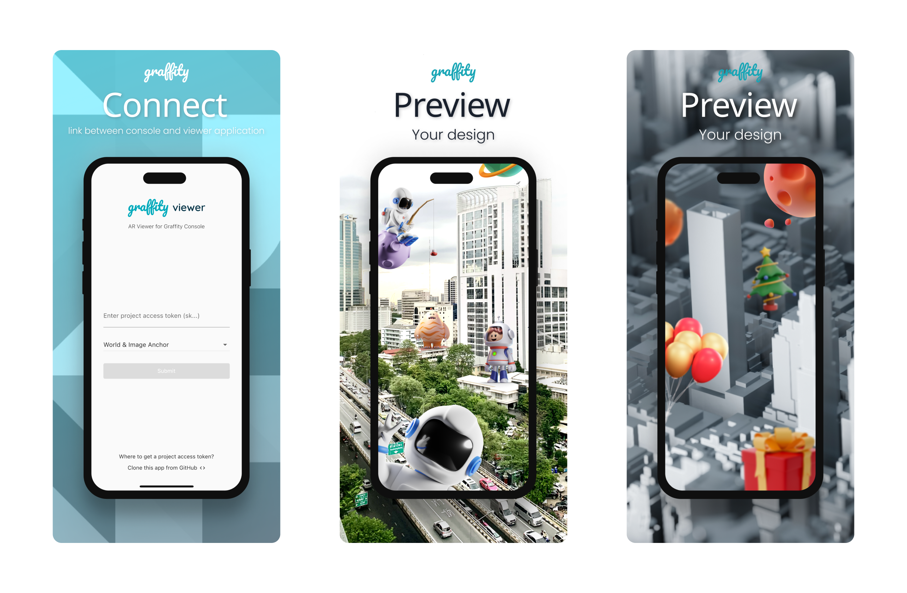

## Graffity Viewer
We create this application on top of Flutter and communicate with Graffity AR native SDK with [Flutter Bridge](https://docs.flutter.dev/platform-integration/platform-channels). You can fork this repo to custom with your own style.



## App Clip Debug
https://developer.apple.com/documentation/appclip/testing-the-launch-experience-of-your-app-clip#Debug-your-App-Clip

## Build & Distribute
### iOS
0. Reference https://docs.flutter.dev/deployment/ios
1. Open Xcode `open ios/Runner.xcworkspace` to change app & build version
2. Run `flutter build ipa` to produce a build archive.
3. Open ipa folder `open build/ios/ipa`
4. Drag and drop the "build/ios/ipa/*.ipa" bundle into the Apple Transport macOS app
    https://apps.apple.com/us/app/transporter/id1450874784
5. Click the Validate App button. If any issues are reported, address them and produce another build. You can reuse the same build ID until you upload an archive.
6. After the archive has been successfully validated, click Distribute App. You can follow the status of your build in the Activities tab of your app’s details page on App Store Connect.

### Android
0. Required `keystore` owner to build release. Ref https://docs.flutter.dev/deployment/android
1. Change app & build version in `android/local.properties` & `pubspec.yaml`
2. Generate signed abb with Android Studio
3. Upload `.aab` to Google Play Console

## Flutterfire error path not found
```
dart pub global activate flutterfire_cli
flutterfire configure
```